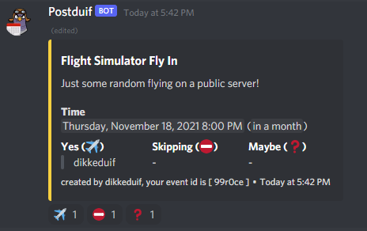

# Discord Calendar Bot

This bot is a simple calendar bot, that allows you to create events for your discord group.

The bot uses mongodb as its database, and nodejs for the app.

The features:
- Create events in whatever channel you want by typing !event in the channel of your choice
- The bot recognizes first time users and asks for your timezone
- You can choose as many registration options (reactions) as you want. By clicking on a reaction you will be registered for that option.
- !modify <eventid> to change some of the event settings after you've created the event
- Flexible translations
- Docker-compose to get the bot up and running in no time
- ...



## Installation & configuration

You need to have docker, docker-compose, typescript and nodejs installed

1. Clone the repository
2. Create your own discord developer app at https://discord.com/developers/applications and get your discord token 
3. run ```NODE_ENV=prod MONGODB_CONNECTION_STRING=mongodb://localhost:27017/calendarbot DISCORD_TOKEN=<your app token here> docker-compose up```
4. Once the bot is up and running you can invite him to your server ```https://discord.com/oauth2/authorize?client_id=<you app client id>&permissions=355408&scope=bot```
5. Once the bot is in one of your channels you can type !event to create a new event

## Bot permissions

By default, people can create events in whatever channel the bot is in. You need to set up your own channel permissions and lock the bot down to one of those channels.

Usually you want to create an #events channel or something similar and make it read only for your users, but not for the bot and for the people who will need to create events.

## Localization

By default, the bot is in English, I did my best to make it flexible, and you can add your own translations in the file ```src/Dictionaries/CalendarTranslations.ts```.

If you want to contribute other languages, please be my guest. The default language can be changed in ```src/settings.ts```


## Questions and support

This is a project I made in my free time. Suggestions and questions are welcome, I'll do my best to help you out, but I might not always be responsive!
