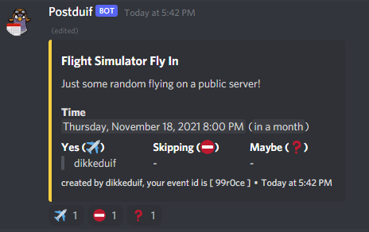

# Discord Calendar Bot

This bot is a simple calendar bot, that allows you to create events for your discord group.

The bot uses mongodb as its database, and nodejs for the app.

The features:
- Create events with ``/event create`` in the channel of your choice — one form for title, description, date, time and registration options
- People sign up by clicking the buttons under the event; the registration columns update live
- ``/event modify`` and ``/event delete`` manage your upcoming events, including the reminder
- ``/timezone set`` controls how the bot reads the dates and times you type
- Events are mirrored into your server's native Events tab (needs the Manage Events permission)
- Flexible translations
- Docker-compose to get the bot up and running in no time
- Set up a reminder just before the event starts
- The legacy ``!event``/``!modify``/``!help`` prefix commands still work during a deprecation window, but they are retiring



## Installation & configuration

You need to have docker and docker-compose installed.

1. Clone the repository
2. Create your own discord developer app at https://discord.com/developers/applications and get your discord token, which you will need in step 3. In the same app, enable **Message Content Intent** under Bot → Privileged Gateway Intents — without it the bot cannot read commands, and login fails with a `Used disallowed intents` (DisallowedIntents) error.
3. run ```NODE_ENV=prod MONGODB_CONNECTION_STRING=mongodb://localhost:27017/calendarbot DISCORD_TOKEN=<your app token here> docker-compose up```
4. Once the bot is up and running you can invite it to your server ```https://discord.com/oauth2/authorize?client_id=<you app client id>&permissions=8590290000&scope=bot%20applications.commands```. Note: this is the client id of the app, not the token id! The ``applications.commands`` scope is what makes the slash commands appear — **servers that invited the bot before this scope existed must re-authorize via this same link** (no need to kick the bot; slash commands simply won't show up until an admin re-authorizes).
5. Once the bot is in one of your channels you can use ``/event create`` to create a new event

## Bot permissions

By default, people can create events in whatever channel the bot is in. You need to set up your own channel permissions and lock the bot down to one of those channels.

Usually you want to create an #events channel or something similar and make it read only for your regular users. Event creators need the ability to write in that channel, since they have to be able to type the ```!event``` command. The bot obviously needs to be able to write and modify in the channel.

The invite link above also includes the **Manage Events** permission: every bot event is then mirrored as a native Discord scheduled event in your server's Events tab (with Discord's own start notification). This is optional — without the permission the bot works exactly as before, just without the Events-tab entry. Servers that invited the bot earlier can grant **Manage Events** to the bot's role to enable it.

## Localization

By default, the bot is in English, I did my best to make it flexible, and you can add your own translations in the file ```src/Dictionaries/CalendarTranslations.ts```.

If you want to contribute other languages, please be my guest. The default language can be changed in ```src/settings.ts```


## Questions and support

This is a project I made in my free time. Suggestions and questions are welcome, I'll do my best to help you out, but I might not always be responsive!
